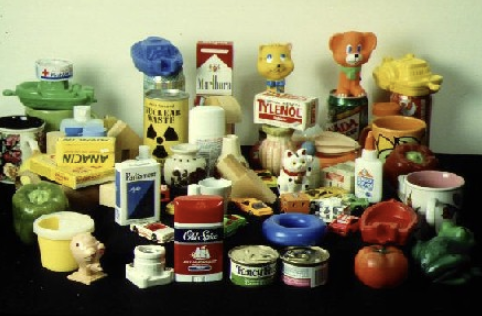

# Sistema de Recuperação de Imagens por Conteúdo (CBIR) com Bag of Visual Words
<div align="center">
      
</div> 

## Sobre o Projeto

Este projeto consiste em um pipeline completo de Visão Computacional com o objetivo de implementar um sistema de Recuperação de Imagens Baseada em Conteúdo (Content-Based Image Retrieval - CBIR).

A solução utiliza a abordagem **Bag of Visual Words (BoVW)** para representar imagens por meio de descritores visuais locais e recuperar automaticamente imagens semelhantes a partir de uma consulta.

O projeto demonstra conceitos fundamentais de Visão Computacional, Recuperação de Informação e Machine Learning não supervisionado.

---

## Objetivo

Desenvolver um mecanismo de busca visual capaz de:

- Extrair características locais das imagens;
- Construir um vocabulário visual utilizando clusterização;
- Representar imagens através de histogramas visuais;
- Calcular similaridade entre imagens;
- Recuperar automaticamente imagens semelhantes.

---
## Dataset

O projeto utiliza o dataset Columbia Object Image Library (COIL-100) existente na plataforma do Kaggle Inc, mais precisamente em https://www.kaggle.com/datasets/jessicali9530/coil100 .

O conjunto de dados COIL-100 foi coletado pelo Centro de Pesquisa em Sistemas Inteligentes do Departamento de Ciência da Computação da Universidade de Columbia.

O banco de dados contém imagens coloridas de 100 objetos.

Os objetos foram colocados em uma plataforma giratória motorizada contra um fundo preto e as imagens foram capturadas em ângulos internos de 5 graus.

Este conjunto de dados foi utilizado em um sistema de reconhecimento de objetos em tempo real, no qual um sensor do sistema identificava o objeto e exibia sua posição angular.

**Detalhes do dataset:**

* Há 7.200 imagens de 100 objetos. Cada objeto foi girado em um suporte giratório de 360 graus para variar sua pose em relação a uma câmera colorida fixa.

* As imagens dos objetos foram capturadas em intervalos de 5 graus entre as poses.Isso corresponde a 72 poses por objeto.

* Em seguida, as imagens foram normalizadas em tamanho.

* Os objetos apresentam uma grande variedade de características geométricas e de refletância complexas.

---

## Pipeline da Solução

```text
Dataset de Imagens
        │
        ▼
Extração de Features (ORB)
        │
        ▼
Agrupamento K-Means
        │
        ▼
Vocabulário Visual
        │
        ▼
Bag of Visual Words
        │
        ▼
Histograma de Features
        │
        ▼
Cálculo de Similaridade
        │
        ▼
Recuperação das Imagens Mais Próximas
```

---

## Principais Etapas Desenvolvidas

### Extração de Características

- Detecção de pontos-chave utilizando ORB;
- Extração de descritores locais;
- Construção de representações robustas das imagens.

### Construção do Vocabulário Visual

- Clusterização dos descritores utilizando K-Means;
- Formação das palavras visuais;
- Criação do dicionário visual do sistema.

### Representação Vetorial

- Conversão das imagens em histogramas de palavras visuais;
- Construção do modelo Bag of Visual Words.

### Recuperação de Imagens

- Cálculo de similaridade entre vetores;
- Ordenação dos resultados por proximidade;
- Exibição das imagens mais semelhantes.

---

## Tecnologias Utilizadas

- Python
- OpenCV
- NumPy
- Scikit-Learn
- Matplotlib

---

## Competências Demonstradas

- Computer Vision
- Image Retrieval
- Content-Based Image Retrieval (CBIR)
- Feature Extraction
- ORB Descriptors
- K-Means Clustering
- Bag of Visual Words
- Similaridade entre Imagens
- Machine Learning Não Supervisionado

---

## Estrutura do Projeto

```text
├── dataset/
│   ├── imagens/
│   └── consulta/
├── sistema_cbir_bag_visual_words.ipynb
└── README.md
```

---

## Aplicações Práticas

- Busca visual de produtos;
- Sistemas de recomendação;
- Recuperação de imagens médicas;
- Organização automática de acervos digitais;
- E-commerce;
- Sistemas de monitoramento visual.

---

## Resultados Obtidos

O sistema foi capaz de representar imagens utilizando descritores locais e recuperar automaticamente imagens visualmente semelhantes, demonstrando a eficácia da abordagem Bag of Visual Words em tarefas de busca visual baseada em conteúdo.

**Notebook do projeto:**[ aqui.](https://github.com/deivison1983/sitema_cbir_bag_visual_words/blob/main/sistema_cbir_bag_visual_words.ipynb)

---

## Conceitos de IA Aplicados

- Feature Extraction
- Computer Vision
- Unsupervised Learning
- Clustering
- Information Retrieval
- Similarity Search

---

## Contexto Acadêmico

Projeto desenvolvido durante a Pós-Graduação em Inteligência Artificial  e Aprendizado de Máquina na PUC Minas, com foco na aplicação de técnicas clássicas de Visão Computacional e Recuperação de Informação.

---

## Autor

Deivison Morais. Visite o meu portfólio de projetos [aqui.](https://deivison1983.github.io/portfolio_projetos/)

Pós-Graduação em Inteligência Artificial e Aprendizado de Máquina - PUC Minas

Professor Orientador: Octavio Santana

### Contatos

<div>
  <a href = "https://www.linkedin.com/in/deivisonmorais/"></a>
  <a href = "mailto:deivison1983@gmail.com"></a>
</div>
